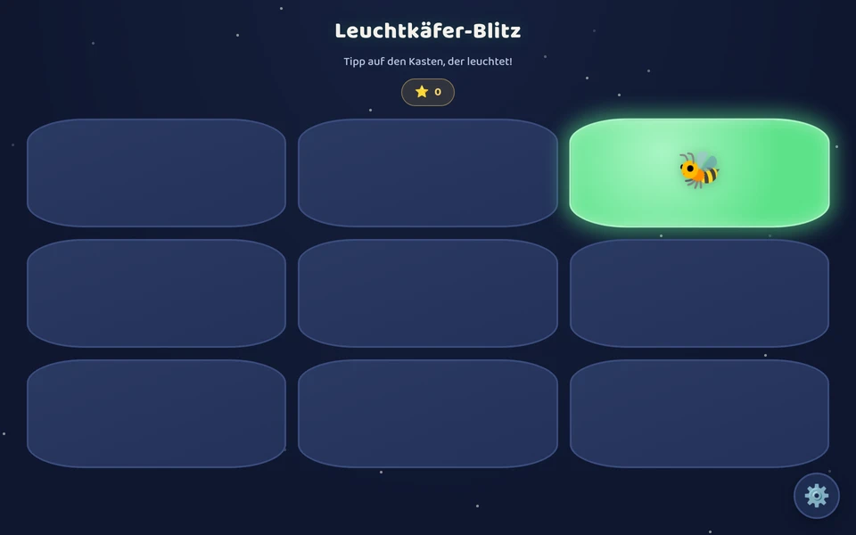
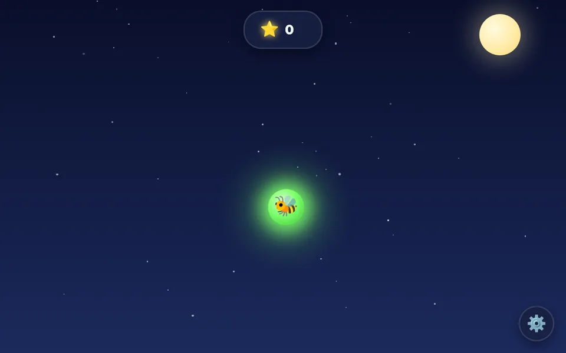

# 🐝 Leuchtkäfer

Sammlung kleiner HTML/JS-Minispiele zum Üben von Klicken, Reaktion und Feinmotorik für kleine Kinder – ohne Werbung, ohne Tracking, direkt im Browser spielbar.

Am einfachsten direkt online spielen über die **[Spieleübersicht](https://pjanfred.github.io/Leuchtkaefer/)** ([`index.html`](./index.html)) – oder das ganze Repository klonen bzw. als ZIP herunterladen (`Code` → `Download ZIP`) und eine der `.html`-Dateien im Browser öffnen: dann wird kein Server, keine Installation und keine Internetverbindung benötigt. Wichtig dabei: Die Schriftart ([Baloo 2](https://fonts.google.com/specimen/Baloo+2), SIL Open Font License) liegt lokal unter [`fonts/`](./fonts) und wird nicht von Google-Servern nachgeladen – dafür muss der `fonts/`-Ordner im selben relativen Pfad neben der HTML-Datei liegen. Lädst du dir nur eine einzelne `.html`-Datei einzeln herunter (ohne den `fonts/`-Ordner), funktioniert das Spiel trotzdem, zeigt dann aber statt Baloo 2 die Standardschrift deines Systems.

## 🎮 Die Spiele

### ⚡ Leuchtkäfer-Blitz
Datei: [`leuchtkaefer-blitz.html`](./leuchtkaefer-blitz.html)

Ein Raster aus Kästchen leuchtet abwechselnd an zufälliger Stelle auf – tippt oder klickt das Kind auf das leuchtende Kästchen, gibt es einen Punkt und einen kleinen Funken-Effekt. Über das Zahnrad-Menü lässt sich die Rastergröße (Spalten/Zeilen) anpassen, damit die Übung mit dem Kind mitwachsen kann.

**Trainiert:** gezieltes Tippen, visuelle Reaktion, Auge-Hand-Koordination.

▶️ [Direkt ausprobieren](https://pjanfred.github.io/Leuchtkaefer/leuchtkaefer-blitz.html)

### 🌙 Leuchtkäfer-Jagd
Datei: [`leuchtkaefer-jagd.html`](./leuchtkaefer-jagd.html)

Ein einzelner Leuchtkäfer fliegt frei über den nächtlichen Bildschirm und prallt wie ein DVD-Logo von den Rändern ab. Fängt das Kind ihn per Klick/Tipp, gibt es Sternchen-Punkte und eine kleine Funkenanimation, danach fliegt der Käfer an neuer Stelle weiter. Im Einstellungs-Menü lassen sich Flugtempo (Schieberegler) und ein kurviger Flugmodus einstellen.

**Trainiert:** Verfolgen bewegter Ziele, Timing, Feinmotorik.

▶️ [Direkt ausprobieren](https://pjanfred.github.io/Leuchtkaefer/leuchtkaefer-jagd.html)

## ☕ Unterstützen

Wenn dir die Spiele gefallen und du das Projekt unterstützen möchtest:

**☕ [Buy me a coffee](https://www.buymeacoffee.com/pjanfred)**

## 📄 Lizenz

Der Code steht unter der [MIT-Lizenz](./LICENSE) – frei nutzbar, veränderbar und weiterverwendbar.

Die eingebundene Schriftart [Baloo 2](https://fonts.google.com/specimen/Baloo+2) steht unter der [SIL Open Font License](./fonts/OFL.txt).
